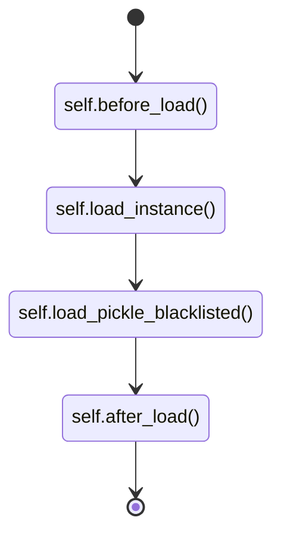

## Loading an VIPicklable object

[`VIPicklable`](/vipickle/reference/vipickle/mixin/#vipickle.mixin.VIPicklable) objects have a
[`load method`](/vipickle/reference/vipickle/mixin/#vipickle.mixin.VIPicklable.load) for loading an object instance :

```pycon
>>> class MyClass(VIPicklable):
...    PICKLE_BLACKLIST = ["unpicklable_attribute"]
...
...    def __init__(self):
...        self.unpicklable_attribute = "do_not_pickle"
...
>>> obj = MyClass()
>>> obj.save("folder")
>>> obj = MyClass.load("folder")
```

??? abstract "VIPicklable.load"

    ::: vipickle.mixin.VIPicklable.load

### Load hooks

Under the hood, the load method does the following :



One can redefine any of these methods to personnalise the saving process :

-   [before_load](/vipickle/reference/vipickle/mixin#vipickle.mixin.VIPicklable.before_load)
-   [load_instance](/vipickle/reference/vipickle/mixin#vipickle.mixin.VIPicklable.load_instance)
-   [load_pickle_blacklisted](/vipickle/reference/vipickle/mixin#vipickle.mixin.VIPicklable.load_pickle_blacklisted)
-   [after_load](/vipickle/reference/vipickle/mixin#vipickle.mixin.VIPicklable.after_load)
